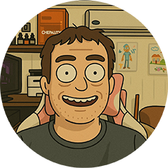

# Artem Ryazanov - Personal Website

A multilingual personal website with a neon retro sci-fi design, featuring interactive elements and automatic language detection.

Visit the live website: [www.artryazanov.com](https://www.artryazanov.com)

## Features

- **Neon Retro Sci-Fi Design**: Dark background with neon elements, creating a futuristic atmosphere
- **Responsive Layout**: Fully responsive design that works on all devices
- **Multilingual Support**: Available in 6 languages with automatic language detection
- **Interactive Elements**:
  - Star animation background
  - Glitch effect on profile picture click
  - Hover animations on all interactive elements
- **Project Showcase**: Displays personal projects with descriptions and links

## Technologies Used

- HTML5
- CSS3 (with CSS Variables)
- JavaScript (Vanilla)
- Google Fonts (Orbitron, Roboto, and language-specific fonts)
- Font Awesome Icons
- SVG for background grid pattern

## Project Structure

- `index.html` - Main entry point with language detection and redirection
- `index_en.html` - English version
- `index_ru.html` - Russian version
- `index_th.html` - Thai version
- `index_zh.html` - Chinese version
- `index_es.html` - Spanish version
- `index_ar.html` - Arabic version (with RTL support)
- `logo.png` - Profile picture
- Various favicon files for different platforms

## Language Support

The website automatically detects the user's browser language and redirects to the appropriate language version. Currently supported languages:

- English (EN)
- Russian (RU)
- Thai (TH)
- Chinese (中文)
- Spanish (ES)
- Arabic (AR) - with Right-to-Left (RTL) support

Users can manually switch between languages using the language switcher in the top-right corner (top-left for Arabic).

## Installation and Usage

1. Clone or download this repository
2. Open `index.html` in your web browser
3. The site will automatically redirect to the appropriate language version based on your browser settings

No server-side processing is required as this is a static website.

## Customization

### Changing Personal Information

Edit the following sections in each language file:

- Profile picture: Replace `logo.png` with your own image
- Name: Update the `<h1 class="name">` element
- Bio: Update the `
` element
- Social links: Modify the links in the `
` section
- Projects: Edit the project cards in the `
` section

### Modifying the Design

- Color scheme: Update the CSS variables in the `:root` selector
- Fonts: Change the Google Fonts import and update the font-family properties
- Background: Modify the SVG pattern in the `body::before` CSS rule

### Adding New Languages

To add a new language:

1. Create a copy of `index_en.html` and name it `index_XX.html` (where XX is the language code)
2. Update the `lang` attribute in the `<html>` tag
3. Translate all text content
4. Add the language to the switcher in all HTML files
5. Update the language detection script in `index.html`

## Credits

- Fonts: [Google Fonts](https://fonts.google.com/)
- Icons: [Font Awesome](https://fontawesome.com/)
- Design inspiration: Neon retro sci-fi aesthetics

## License

© 2025 Artem Ryazanov. All rights reserved.